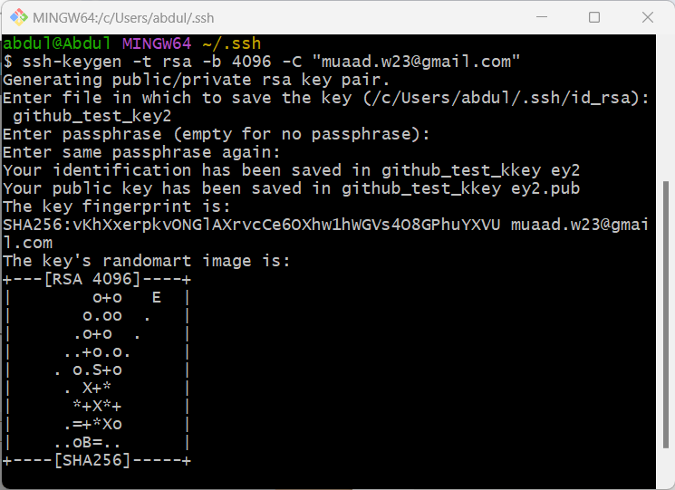
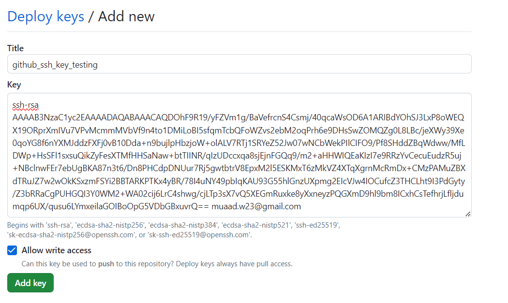
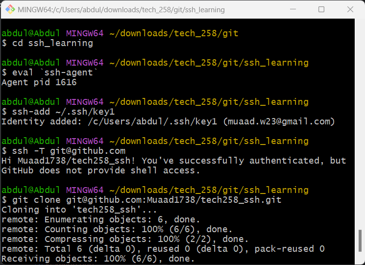

# SSH Keys Setup

## Create your ssh key

## Deploy your key on Github

## add the key 

## Commands

### Generate a new RSA SSH key with a bit length of 4096 and an email identifier
ssh-keygen -t rsa -b 4096 -C "muaad.w23@gmail.com"

### Start the SSH agent
eval `ssh-agent`

### Add the SSH private key to the SSH agent
ssh-add ~/.ssh/key1

### Test the SSH connection to GitHub to verify setup
ssh -T git@github.com

### Clone a repository from GitHub using SSH
git clone git@github.com:Muaad1738/tech258_ssh.git

